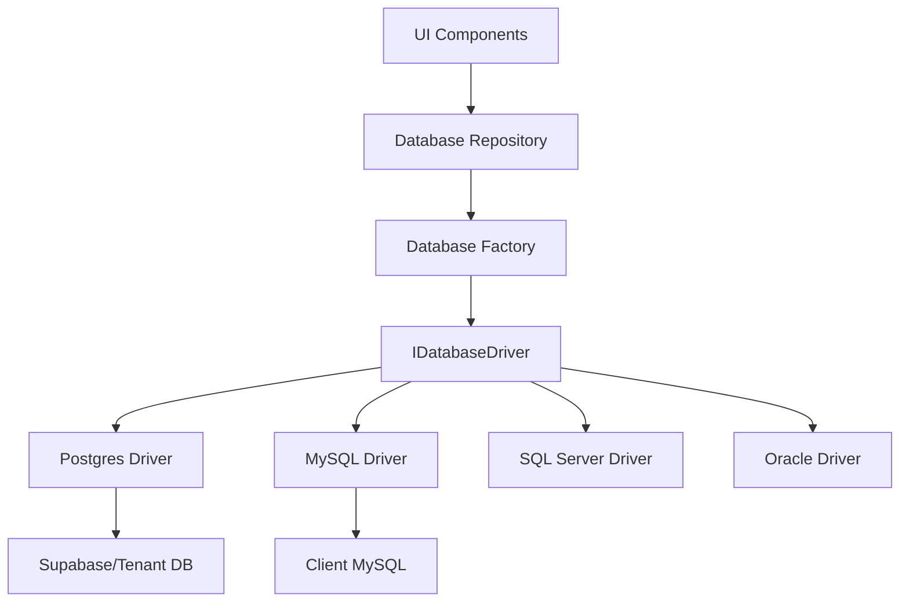

# Decoupling Veritum Pro: Multi-DB Architecture

This plan outlines the steps to transition Veritum Pro from a Supabase-centric architecture to a multi-database "Driver Pattern" supporting Oracle, Postgres, MySQL, SQL Server, etc.

## 🎯 Goal
Decouple components from the raw `SupabaseClient` and introduce a unified repository layer powered by **Drizzle ORM**.

## 🏗️ Architecture Design: Interface Driver Pattern

## 📋 Steps

### 1. Foundation & Infrastructure
- [x] Create this implementation plan.
- [ ] Install Drizzle ORM and required drivers.
- [ ] Define the `IBaseRepository<T>` and specific repositories.

### 2. Drizzle Schema Definition
- [ ] Define schemas for `persons`, `users`, and `tenants`.

### 3. Implementation of Drivers
- [ ] **Supabase/Postgres Driver.**
- [ ] **Generic SQL Driver.**

### 4. Component Refactoring
- [ ] Update `PersonManagement` to use the new Repository layer.
